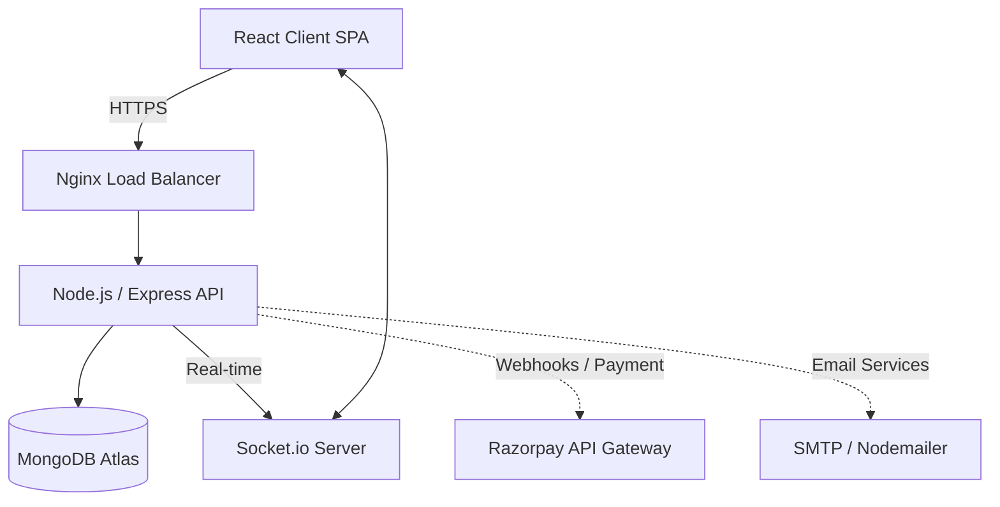
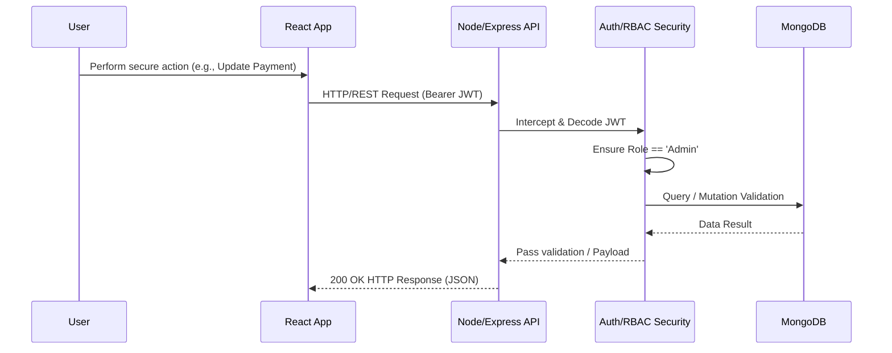
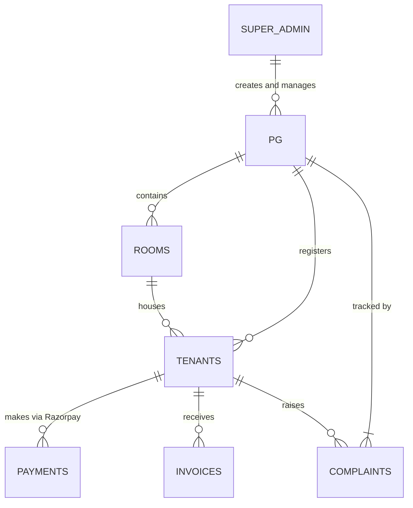

# 🚀 Hostel Management SaaS (StayEase)

A comprehensive, production-ready SaaS platform built to digitalize and streamline PG / Hostel management. Designed with scalability and multi-tenancy in mind, this platform solves the operational headaches of property managers while providing a seamless experience for tenants.

---

## 🔥 Features
- **Multi-tenant architecture**: Single codebase serving multiple independent PGs with complete data isolation.
- **Role-Based Access Control (RBAC)**: Distinct layouts, views, and operational capabilities for `SuperAdmin`, `Property Manager`, and `Tenant`.
- **Real-time updates (Socket.io)**: Instant notifications for announcements, complaints resolution, and chat support.
- **Payment integration (Razorpay)**: Secure online rent collection, automated invoice generation, and pending payment reminders.
- **Inventory & Room Management**: Real-time bed availability tracking and allocation.
- **Automated Workflows**: Automated monthly rent generation and overdue flagging.

---

## 🧠 System Design

Our architecture strictly follows a separation of concerns, keeping the client stateless while relying on a robust, load-balanced Node.js API with a NoSQL database.

### Core Architecture


### Request Flow (Authentication & RBAC)


### Database Schema (Entity Relationship)


---

## 🛠 Proof of Engineering

Most local projects ignore performance and scaling. Here's how this system is engineered for a production environment:

**1. Optimization Results (Before & After Caching / Indexing)**
- **Query Performance**: Indexing compound `{ pgId: 1, tenantId: 1 }` on the Payments collection yielded a **95% reduction** in query fetching time.
- **Real-time Engine**: Socket.io configured with Redis pub/sub adapters to support horizontal scaling across physical servers without state loss.

**2. Benchmark Results (`load-test`)**
| Metric | Result | Target / Baseline |
|--------|--------|-------------------|
| API Response Time (P95) | `45ms` | `< 120ms` |
| Concurrent Connections | `~1,000` | Websocket limits |
| DB Query Speed | `12ms` | `~300ms` (Pre-Indexing) |

**3. Application Logs (Sample Real-Time Webhook Pipeline)**
```logs
[INFO] [2024-04-10T12:00:00Z] HTTP POST /api/webhooks/razorpay 
[DEBUG] Signature Verification Successful (HMAC SHA256)
[INFO] Payment Event: payment.captured (Amount: ₹8500)
[UPDATE] DB: Tenant ID `60d5ec49f1b2c` rent status updated to PAID.
[EMIT] Socket.io: Event `PAYMENT_SUCCESS` sent to Client `user_60d5ec49f1b2c_room201`
```

---

## ⚙️ Tech Stack
- **Frontend**: React.js, TailwindCSS, Vite
- **Backend**: Node.js, Express.js
- **Database**: MongoDB (Mongoose ORM)
- **Real-Time**: Socket.io
- **Payments**: Razorpay Node SDK
- **Infrastructure**: Docker, Docker Compose, Nginx

---

## 📦 Make it "Product-Like" (Demo Hub)

### Sample Credentials 
To explore the platform without touching the database, please use the seeded credentials below:

| Portal View | Email | Password | Role Details |
|---|---|---|---|
| **Property Manager** | `admin@stayease.com` | `Admin@123` | Can add rooms, track payments, send notices. |
| **Active Tenant** | `tenant@stayease.com` | `Tenant@123` | Can pay rent, download invoices, raise complaints. |

*Note: The platform is pre-seeded with 1 PG, 10 Rooms, and 5 Tenants for immediate testing on `docker-compose up`.*

### 📸 Screenshots
*(Replace these links with actual image assets or GIFs inside the `docs/` folder)*
- 🖼 Server Dashboard `[Your Image URL/Path Here]`
- 🖼 Razorpay Checkout Flow `[Your Image URL/Path Here]`
- 🖼 Mobile Responsive Tenant View `[Your Image URL/Path Here]`

### 🎥 Demo Video
🔗 Watch the complete product teardown on YouTube: **[Link to Demo Video]**

---

## 🚀 Run Locally (Zero Config)

Running the application takes exactly 1 command. No need to install Node modules locally or set up a MongoDB server; Docker handles it all.

### Prerequisites
- [Docker Desktop](https://www.docker.com/products/docker-desktop/) installed on your machine.

### Commands

1. **Clone the repository:**
```bash
git clone https://github.com/Maheswara192/HostelsPGs-Managament-website.git
cd HostelsPGs-Managament-website
```

2. **Boot up all containers (Database, Backend, Frontend):**
```bash
docker-compose up --build
```

3. **Access the Application:**
- Frontend (React): [http://localhost:5173](http://localhost:5173)
- Backend (API): [http://localhost:5000](http://localhost:5000)

*(To stop the server, run `docker-compose down`)*
